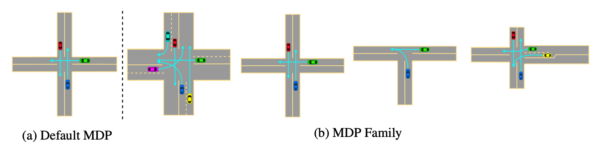
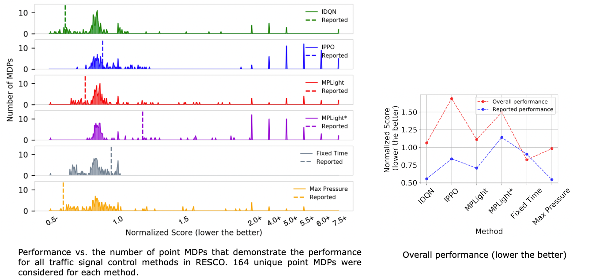

<p align="center">
    
</p>
<br>
Evaluations of Deep Reinforcement Learning (DRL) methods are an integral part of scientific progress of the field. Beyond designing DRL methods for general intelligence, designing task-specific methods is becoming increasingly prominent for real-world applications. In these settings, the standard evaluation practice involves using a few instances of Markov Decision Processes (MDPs) to represent the task. However, many tasks induce a large family of MDPs owing to variations in the underlying environment, particularly in real-world contexts. For example, in traffic signal control, variations may stem from intersection geometries and traffic flow levels. The select MDP instances may thus inadvertently cause overfitting, lacking the statistical power to draw conclusions about the method's true performance across the family. In this article, we augment DRL evaluations to consider parameterized families of MDPs. We show that in comparison to evaluating DRL methods on select MDP instances, evaluating the MDP family often yields a substantially different relative ranking of methods, casting doubt on what methods should be considered state-of-the-art. We validate this phenomenon in standard control benchmarks and the real-world application of traffic signal control. At the same time, we show that accurately evaluating on an MDP family is nontrivial. Overall, this work identifies new challenges for empirical rigor in reinforcement learning, especially as the outcomes of DRL trickle into downstream decision-making.

### Case Study: Traffic Signal Control

#### Shortcomings of Point MDP-based Evaluations

<p align="center">
    
</p>

Interestingly, we see a significant result change from previously reported results. Although the Fixed time controller is regarded as an underperforming method as per reported performance, we find that under the MDP family-based evaluations, the non-RL Fixed time controller and Max pressure controller perform significantly better than all the four DRL controllers. We note that fine-tuning a non-RL Fixed time controller is simple enough that it does not pose a computational burden and can be done easily, even on a regular computer. While reported performances ranked IPPO as a well-performing model with a normalized score of 0.84, we see that, in fact, it is the lowest-performing method and that the revised normalized score is as high as 1.7 (even cannot outperform an untuned fixed time controller). It is thus clear that point MDP-based evaluations can be misleading and may pose performance benefits that do not generalize to the MDP family. 

### Citation

```
@inproceedings{jayawardana2022evaluations
               author={Jayawardana, Vindula and Tang, Catherine and Li, Sirui and Suo, Dajiang and Wu, Cathy}, 
               booktitle={Advances in Neural Information Processing Systems (NeurIPS)}, 
               title={The Impact of Task Underspecification in Evaluating Deep Reinforcement Learning}, 
               year={2022}}
```

### Authors 

<div style="text-align: left;">

<div class="person">
  <br>
  <a href="{{ person.url | relative_url }}">{{ person.name }}</a><br>
  <span>{{ person.title | replace: '&', '<br>' }}</span>
</div>


</div>

### Acknowledgement

This work was supported by the MIT Amazon Science Hub, the US DOT’s Federal Highway Administration and Utah Department of Transportation under project number F-ST99(783), the MIT-IBM Watson AI Lab, a gift from Mathworks, and the National Science Foundation (NSF) under grant number 2149548. The authors acknowledge MIT SuperCloud and the Lincoln Laboratory Supercomputing Center for providing computational resources supporting the research results in this paper. The authors are also grateful for insightful discussions with Jiaqi Zhang and the constructive suggestions from the anonymous reviewers.
<br><br>


<p style="text-align:right;font-size:small;">
    Website Design <a href="https://github.com/pages-themes/cayman"><span>&#9734;</span></a> and <a href="https://github.com/agarwl/rliable"><span>&#9734;</span></a>
</p>